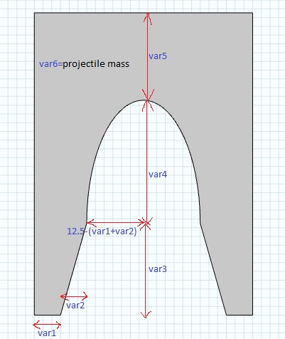
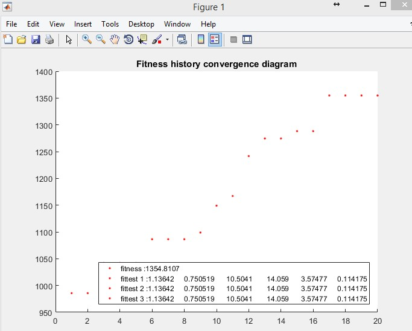
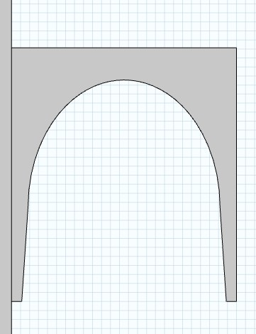

# Armature Shape Optimization of an Electromagnetic Launcher Using Genetic Algorithm - Study

### To Do List:

- Geometric identities for independent variables of optimization algorithm
- Update genetic algorithm according to these geometric variables 
- Find the change of armature force with the change of excitation frequency
- Find frequency components of excitation current
- Use frequency domain solution for FEM with using frequency components of excitation current as cost function
- Use armature kinetic energy instead of its acceleration for the optimization parameter

--------------

### case1
- Time dependent study with 200kJ one pulse current, constraints:

1<x1<10, 0<x2<10, 0<x3<15, 0<x4<15, 0<x5<15, 0.1<mass<0.2

and

x3+x4+x5>25 --> length of armature should not be too small

x1+x2<10 --> 12.5-(x1+x2) should be greater than zero

- fittest energy values and variable values:

- optimum geometry:

